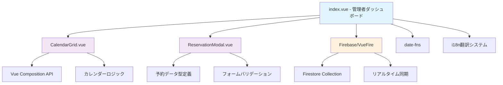
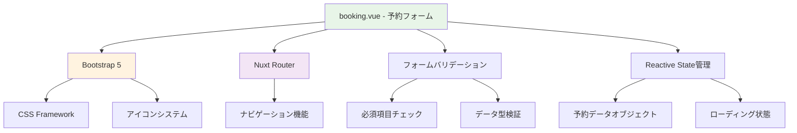
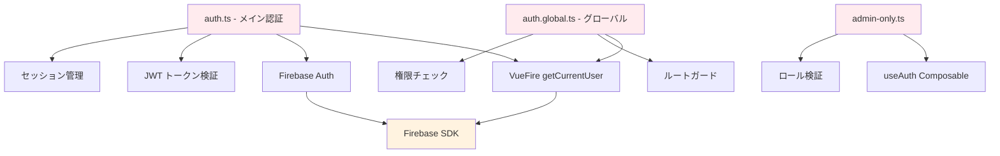

# フロントエンドコード分析レポート - コンポーネント依存関係図

## 📊 コンポーネント依存関係図

### 1. index.vue（管理者ダッシュボード）の依存関係



### 2. booking.vue（予約フォーム）の依存関係



### 3. 認証ミドルウェア依存関係



## 🔗 主要コンポーネント分析

### 1. pages/index.vue（管理者ダッシュボード）

**コンポーネント構造：**
- **外部依存**: VueFire, Firebase Firestore, date-fns, i18n
- **子コンポーネント**: CalendarGrid, ReservationModal
- **主要機能**: 統計表示、カレンダー管理、予約管理

**再利用可能な部分：**
- 統計カード（StatsCard）
- カレンダーナビゲーション
- ユーザーメニューコンポーネント
- クイックアクションパネル

**依存関係の特徴：**
- Firebase Firestoreとのリアルタイム同期
- VueFire Composition APIの活用
- カスタムCSS変数による統一したデザインシステム

### 2. pages/booking.vue（予約フォーム）

**コンポーネント構造：**
- **外部依存**: Bootstrap 5, Nuxt Router
- **主要機能**: サービス選択、日時選択、顧客情報入力

**再利用可能な部分：**
- サービス選択コンポーネント
- 日時選択コンポーネント
- 進捗ステップインジケーター
- 成功モーダル

**課題：**
- 単一ファイルに全機能が集約（1ファイル249行）
- コンポーネント分割が不十分
- Firebase統合が未完了（TODO状態）

### 3. 認証システム

**ミドルウェア構成：**
- **auth.ts**: メイン認証ロジック（386行）
- **auth.global.ts**: 軽量グローバル版（156行）
- **admin-only.ts**: 管理者権限チェック（38行）

**セキュリティ機能：**
- JWT トークン検証
- セッション期限管理（8時間）
- CSRF保護
- ロールベースアクセス制御（RBAC）

## 🚨 必要な修正箇所リスト

### 🔴 高優先度（即座修正が必要）

#### 1. booking.vue → ルートページ移動時の修正
**問題点：**
- 現在のbooking.vueは独立したページとして実装されている
- ルートページ（index.vue）に移動する際の構造的不整合

**必要な修正：**
```
📁 修正対象ファイル:
├── pages/booking.vue → pages/index.vue への統合準備
├── pages/index.vue → 管理者機能とユーザー機能の分離
└── middleware/auth.ts → ルート保護設定の更新

🔧 具体的な作業:
1. booking.vue の予約フォーム部分をコンポーネント化
2. index.vue から管理者専用機能を admin/index.vue へ移動
3. 新しい index.vue でユーザー向け予約フォームを実装
4. 認証ミドルウェアでルート保護を適切に設定
```

#### 2. Firebase統合の完了
**問題点：**
- booking.vue のFirestore保存処理が未実装（TODO状態）
- 実際の予約データがFirebaseに保存されない

**必要な修正：**
```typescript
// booking.vue 内の未実装部分
const handleBooking = async () => {
  // TODO: Firebase Firestoreに保存する処理を実装 ← これを実装
  console.log('予約データ:', bookingData.value)
}
```

#### 3. コンポーネント分離（booking.vue）
**問題点：**
- 249行の単一ファイルに全機能が集約
- 再利用性とメンテナンス性が低い

**必要な修正：**
```
📁 作成すべきコンポーネント:
├── components/Booking/ServiceSelection.vue
├── components/Booking/StylistSelection.vue  
├── components/Booking/DateTimeSelection.vue
├── components/Booking/CustomerForm.vue
├── components/Booking/ProgressSteps.vue
└── components/Booking/SuccessModal.vue
```

### 🟡 中優先度（次の開発サイクルで対応）

#### 4. デザインシステムの統一
**問題点：**
- index.vue: カスタムCSS変数 + 独自デザインシステム
- booking.vue: Bootstrap 5
- 一貫性のないUI/UX

**必要な修正：**
```
🎨 統一すべき要素:
├── カラーパレット（CSS変数 vs Bootstrap色）
├── タイポグラフィ（フォントサイズ、weight）
├── アイコンシステム（Bootstrap Icons統一）
├── レスポンシブブレークポイント
└── アニメーション・トランジション
```

#### 5. TypeScript型定義の強化
**問題点：**
- booking.vue: 型定義が不十分（script setupでref型のみ）
- index.vue: 詳細な型定義あり
- 型安全性の不一致

**必要な修正：**
```typescript
// 追加すべき型定義
interface BookingFormData {
  service: ServiceType
  stylist: StylistId | null
  date: DateString
  time: TimeSlot
  customerInfo: CustomerInfo
  notes?: string
}

interface ServiceType {
  id: string
  name: string
  price: number
  duration: number
}
```

### 🟢 低優先度（将来的な改善）

#### 6. パフォーマンス最適化
**現在の状況：**
- index.vue: パフォーマンス測定済み（3秒閾値チェックあり）
- booking.vue: パフォーマンス測定なし

**改善提案：**
```
⚡ 最適化項目:
├── 画像の遅延読み込み
├── コンポーネントの遅延読み込み
├── FirestoreクエリのRTK Query化
└── キャッシュ戦略の実装
```

#### 7. アクセシビリティ向上
**現在の状況：**
- index.vue: aria-label, ダークモード対応あり
- booking.vue: 基本的なform要素のみ

**改善提案：**
```
♿ アクセシビリティ改善:
├── キーボードナビゲーション強化
├── スクリーンリーダー対応
├── フォーカス管理
└── カラーコントラスト改善
```

## 📋 優先度別実装スケジュール

### フェーズ1（高優先度 - 2週間）
1. **booking.vue → index.vue 移動準備**
   - コンポーネント分離
   - ルート構造の再設計
   - 認証フローの調整

2. **Firebase統合完了**
   - Firestore保存処理実装
   - リアルタイム予約状況更新
   - エラーハンドリング強化

### フェーズ2（中優先度 - 3週間）
3. **デザインシステム統一**
   - 共通コンポーネントライブラリ作成
   - CSS変数とBootstrapの統合
   - レスポンシブデザインの統一

4. **TypeScript型安全性向上**
   - 全面的な型定義追加
   - Validation schema実装
   - 型エラーゼロ達成

### フェーズ3（低優先度 - 4週間）
5. **パフォーマンス・アクセシビリティ向上**
   - Core Web Vitals最適化
   - アクセシビリティ監査・対応
   - PWA化検討

## 🎨 UI/UX改善提案

### 1. ユーザーエクスペリエンス（UX）改善

#### 📱 予約フローの最適化
**現在の問題：**
- booking.vue で3ステップ表示されているが、実際は1ページに全て表示
- ユーザーは進捗感を感じにくい

**改善提案：**
```
🔄 マルチステップフォーム実装:
Step 1: サービス・スタイリスト選択
├── サービス選択（価格・所要時間表示）
├── スタイリスト選択（プロフィール・得意分野表示）
└── 次へボタン

Step 2: 日時選択
├── カレンダービュー（空き状況リアルタイム表示）
├── 時間選択（スタイリストの空き時間のみ表示）
└── 次へボタン

Step 3: お客様情報・確認
├── 顧客情報入力（必須項目のみ）
├── 予約内容確認（サマリー表示）
└── 予約確定ボタン
```

#### 🎯 予約可能性の事前表示
**現在の問題：**
- 日時選択が固定リストで、実際の空き状況と連動していない
- ユーザーが選択した後にエラーになる可能性

**改善提案：**
```javascript
// リアルタイム空き状況表示
const availableSlots = computed(() => {
  return timeSlots.filter(slot => {
    return !appointments.value.some(apt => 
      apt.date === selectedDate.value && 
      apt.startTime === slot.time &&
      apt.stylistId === selectedStylist.value
    )
  })
})
```

### 2. ユーザーインターフェース（UI）改善

#### 🎨 デザインシステムの統一
**現在の問題：**
- index.vue: カスタムデザインシステム（モダン、ミニマル）
- booking.vue: Bootstrap 5（従来型、汎用的）

**改善提案：**
```scss
// 統一されたデザイントークン
:root {
  // カラーパレット
  --primary-50: #eff6ff;
  --primary-500: #3b82f6; // メインブランドカラー
  --primary-600: #2563eb;
  --primary-700: #1d4ed8;
  
  // タイポグラフィ
  --font-family-primary: 'Inter', -apple-system, BlinkMacSystemFont, sans-serif;
  --font-size-xs: 0.75rem;
  --font-size-sm: 0.875rem;
  --font-size-base: 1rem;
  --font-size-lg: 1.125rem;
  
  // スペーシング
  --space-1: 0.25rem;
  --space-2: 0.5rem;
  --space-4: 1rem;
  --space-8: 2rem;
  
  // アニメーション
  --transition-fast: 0.15s ease-in-out;
  --transition-base: 0.25s ease-in-out;
  --transition-slow: 0.35s ease-in-out;
}
```

#### 📱 レスポンシブデザインの強化
**現在の状況：**
- index.vue: 詳細なレスポンシブ対応（1024px, 768px, 640px）
- booking.vue: Bootstrap グリッドのみ

**改善提案：**
```scss
// モバイルファーストアプローチ
.booking-form {
  // Mobile (< 640px)
  padding: 1rem;
  
  @media (min-width: 640px) {
    // Tablet
    padding: 1.5rem;
    max-width: 28rem;
    margin: 0 auto;
  }
  
  @media (min-width: 1024px) {
    // Desktop
    padding: 2rem;
    max-width: 32rem;
  }
}
```

### 3. インタラクションデザイン改善

#### ⚡ マイクロインタラクション追加
**改善提案：**
```vue
<template>
  <!-- サービス選択時のフィードバック -->
  <div 
    class="service-card"
    :class="{ selected: selectedService === service.id }"
    @click="selectService(service)"
  >
    <transition name="check-mark">
      <icon v-if="selectedService === service.id" name="check-circle" />
    </transition>
    <!-- サービス内容 -->
  </div>
</template>

<style>
.service-card {
  transition: all var(--transition-base);
  transform: scale(1);
}

.service-card:hover {
  transform: scale(1.02);
  box-shadow: var(--shadow-lg);
}

.service-card.selected {
  border-color: var(--primary-500);
  background: var(--primary-50);
}

.check-mark-enter-active {
  transition: all 0.3s ease;
}

.check-mark-enter-from {
  opacity: 0;
  transform: scale(0.5);
}
</style>
```

#### 🔄 ローディング状態の改善
**現在の問題：**
- booking.vue: 基本的なスピナーのみ
- ユーザーに何が起こっているかが不明

**改善提案：**
```vue
<template>
  <loading-button 
    :loading="isSubmitting"
    :progress="submitProgress"
    @click="handleSubmit"
  >
    <template #default>予約を確定する</template>
    <template #loading>
      <span v-if="submitProgress < 30">予約データを準備中...</span>
      <span v-else-if="submitProgress < 70">Firebaseに保存中...</span>
      <span v-else>メール送信中...</span>
    </template>
  </loading-button>
</template>
```

### 4. エラーハンドリングとフィードバック改善

#### ❌ エラーメッセージの改善
**現在の問題：**
- booking.vue: `alert()` を使用（ユーザビリティが低い）

**改善提案：**
```vue
<template>
  <!-- インラインバリデーション -->
  <form-field 
    v-model="customerName"
    label="お名前"
    :error="errors.customerName"
    :success="validations.customerName"
    required
  />
  
  <!-- トースト通知 -->
  <toast-notification 
    v-if="notification"
    :type="notification.type"
    :message="notification.message"
    @dismiss="clearNotification"
  />
</template>
```

#### ✅ 成功フィードバックの改善
**改善提案：**
```vue
<template>
  <!-- 段階的な成功表示 -->
  <success-animation v-if="bookingComplete">
    <check-animation />
    <h2>予約が完了しました！</h2>
    <booking-summary :booking="completedBooking" />
    <div class="next-steps">
      <p>📧 確認メールを送信しました</p>
      <p>📅 カレンダーに追加できます</p>
      <button @click="addToCalendar">カレンダーに追加</button>
    </div>
  </success-animation>
</template>
```

### 5. アクセシビリティ（A11y）改善

#### ♿ キーボードナビゲーション
**改善提案：**
```vue
<template>
  <div 
    class="service-option"
    tabindex="0"
    role="radio"
    :aria-checked="isSelected"
    @keydown.space.prevent="selectOption"
    @keydown.enter.prevent="selectOption"
  >
    <!-- サービス内容 -->
  </div>
</template>
```

#### 🔊 スクリーンリーダー対応
**改善提案：**
```vue
<template>
  <!-- 状況説明の追加 -->
  <div aria-live="polite" class="sr-only">
    <span v-if="currentStep === 1">ステップ1: サービスを選択してください</span>
    <span v-if="selectedService">{{ selectedService.name }}を選択しました</span>
  </div>
  
  <!-- 進捗状況の音声案内 -->
  <progress 
    :value="currentStep" 
    max="3"
    :aria-label="`予約手順 ${currentStep} / 3`"
  />
</template>
```

## 📊 実装優先度マトリックス

| 改善項目 | ユーザー価値 | 実装工数 | 優先度 |
|---------|------------|----------|--------|
| マルチステップフォーム | 高 | 中 | 🔴 高 |
| リアルタイム空き状況 | 高 | 高 | 🔴 高 |
| デザインシステム統一 | 中 | 高 | 🟡 中 |
| マイクロインタラクション | 中 | 低 | 🟡 中 |
| エラーハンドリング改善 | 高 | 低 | 🔴 高 |
| アクセシビリティ対応 | 中 | 中 | 🟢 低 |

## 🎯 最終目標：ユーザー体験の一貫性

```
目指すべきユーザージャーニー:
1. 🌟 直感的な予約フロー
2. ⚡ レスポンシブで高速な操作
3. 🎨 一貫したデザイン言語
4. 💬 明確で親切なフィードバック
5. ♿ 誰でも使いやすいアクセシビリティ
```