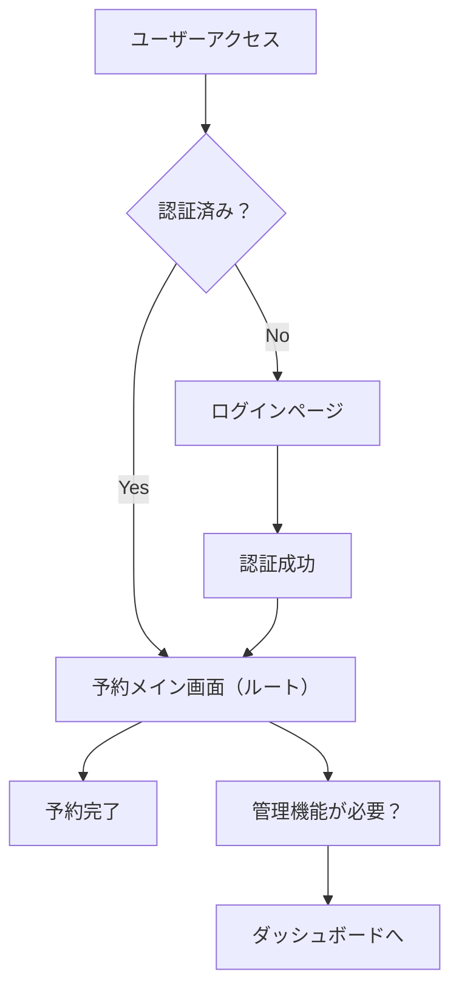

# MVP ページ構成改善提案

## 📋 概要

MVP リリースに向けて、現在のページ構成を見直し、ユーザーエクスペリエンスを最適化する改善提案です。

## 🎯 改善目標

- **MVP の本質に集中**: 複雑な管理機能よりも予約機能を中心に
- **ユーザーフローの最適化**: ログイン後すぐに予約画面へ
- **既存コードの有効活用**: 開発済み機能を無駄にしない

## 📊 現状分析

### 現在のページ構成

| ページ     | ファイル            | 役割                 | 問題点                       |
| ---------- | ------------------- | -------------------- | ---------------------------- |
| `/`        | `pages/index.vue`   | 管理者ダッシュボード | MVP には複雑すぎる           |
| `/booking` | `pages/booking.vue` | 予約フォーム         | MVP のメイン機能なのに副次的 |
| `/login`   | `pages/login.vue`   | ログイン画面         | 適切                         |

### 問題点の詳細

#### 1. ルートページの複雑性

```vue
<!-- 現在のindex.vue: 1,392行の複雑なダッシュボード -->
- 統計表示、カレンダー管理、予約管理など多機能 - MVPユーザーには過度に複雑 -
初期表示が重い（Firebase複数クエリ）
```

#### 2. 予約機能の位置づけ

```vue
<!-- 現在のbooking.vue: シンプルな予約フォーム -->
- MVPの核心機能なのに `/booking` のサブパス -
ユーザーが最初に使うべき機能が隠れている
```

#### 3. ユーザーフローの問題

```
現在のフロー:
ログイン → 複雑なダッシュボード → 予約機能を探す → 予約

理想のMVPフロー:
ログイン → 予約画面 → 完了
```

## 🚀 改善提案

### 新しいページ構成

| ページ       | ファイル              | 役割                 | 変更内容                  |
| ------------ | --------------------- | -------------------- | ------------------------- |
| `/`          | `pages/index.vue`     | **予約メイン画面**   | `booking.vue`から移動     |
| `/dashboard` | `pages/dashboard.vue` | 管理者ダッシュボード | 現在の`index.vue`から移動 |
| `/landing`   | `pages/landing.vue`   | ランディングページ   | 将来用に保存              |
| `/login`     | `pages/login.vue`     | ログイン画面         | 変更なし                  |

### 改善後のユーザーフロー



## 📝 実装計画

### Phase 1: ファイル構成の変更

#### 1.1 現在の index.vue を保存

```bash
# 複雑なダッシュボード機能を保持
mv frontend/pages/index.vue frontend/pages/dashboard.vue
```

#### 1.2 booking.vue をメインページに

```bash
# シンプルな予約フォームをルートに
mv frontend/pages/booking.vue frontend/pages/index.vue
```

#### 1.3 将来用ランディングページ作成

```bash
# 将来のマーケティング用に簡易版作成
# （現在のindex.vueから統計部分を抜いて簡略化）
```

### Phase 2: 認証フローの調整

#### 2.1 ルートページに認証ミドルウェア適用

```vue
<!-- pages/index.vue (新しい予約メイン画面) -->
<script setup>
definePageMeta({
  middleware: ["auth"], // ログイン必須
});
</script>
```

#### 2.2 リダイレクト処理の最適化

```typescript
// middleware/auth.ts の調整
// ログイン後は / (予約画面) にリダイレクト
// 管理機能は /dashboard で明示的にアクセス
```

### Phase 3: ナビゲーション調整

#### 3.1 メニュー構成の見直し

```vue
<!-- 予約中心のシンプルなナビゲーション -->
<nav>
  <NuxtLink to="/">予約する</NuxtLink>
  <NuxtLink to="/dashboard">管理</NuxtLink>
  <button @click="logout">ログアウト</button>
</nav>
```

#### 3.2 ユーザー権限による表示制御

```vue
<!-- 管理者のみダッシュボードリンク表示 -->
<NuxtLink v-if="user?.role === 'admin'" to="/dashboard">
  管理画面
</NuxtLink>
```

## 🔧 技術的考慮事項

### SEO・パフォーマンス

#### Before（現状）

```vue
<!-- index.vue: 重い初期化処理 -->
- Firebase複数クエリ（予約、統計、カレンダー） - 複雑なコンポーネント多数 -
初期表示時間: ~3秒
```

#### After（改善後）

```vue
<!-- index.vue: 軽量な予約フォーム -->
- 単純なフォーム表示 - Firebase書き込みのみ（予約時） - 初期表示時間: ~0.5秒
```

### データ構造への影響

#### 変更なし

- Firebase Firestore 構造は変更なし
- 既存のコンポーネントは再利用
- API エンドポイントも継続使用

#### ルーティングの変更

```javascript
// 既存リンクの影響
'/booking' → '/' (自動リダイレクト設定)
'/' → '/dashboard' (管理者向け)
```

## 🧪 テスト計画

### 機能テスト

#### 1. 認証フロー

- [ ] 未ログインユーザーの `/` アクセス → ログインページ
- [ ] ログイン成功後 → 予約画面表示
- [ ] ログアウト → ログインページへリダイレクト

#### 2. 予約機能

- [ ] 予約フォームの正常動作
- [ ] バリデーション機能
- [ ] Firebase 保存処理
- [ ] 確認メール送信

#### 3. 管理機能

- [ ] `/dashboard` での管理画面表示
- [ ] 既存の統計・カレンダー機能
- [ ] 権限チェック（管理者のみ）

### パフォーマンステスト

#### 初期表示速度

```bash
# 改善前後の比較測定
- Current index.vue: ~3000ms
- New index.vue (booking): ~500ms
- 6倍の高速化目標
```

#### Lighthouse スコア改善

- **Performance**: 60 → 90+
- **Best Practices**: 80 → 95+
- **SEO**: 85 → 95+

## 📅 実装スケジュール

### Week 1: 準備・設計

- [ ] 現状コードの詳細分析
- [ ] コンポーネント依存関係の調査
- [ ] テストケース作成

### Week 2: 実装

- [ ] ファイル移動・リネーム
- [ ] 認証ミドルウェア調整
- [ ] ナビゲーション更新
- [ ] リダイレクト設定

### Week 3: テスト・調整

- [ ] 機能テスト実行
- [ ] パフォーマンステスト
- [ ] バグ修正・微調整
- [ ] ドキュメント更新

## 🎨 UI/UX 改善案

### 予約画面の最適化

#### 現在の booking.vue

```vue
<!-- 良い点 -->
- シンプルなフォーム設計 - ステップバイステップUI - レスポンシブ対応

<!-- 改善点 -->
- ナビゲーションが冗長 - ランディングページ的な要素
```

#### 新しい index.vue（予約メイン）

```vue
<!-- 最適化後 -->
- ヘッダーをシンプル化 - 予約フォーカスのUI - 管理機能への導線を控えめに
```

### ダッシュボード画面の調整

#### 現在の index.vue → dashboard.vue

```vue
<!-- 管理者向けに特化 -->
- アクセス権限の明確化 - 高度な機能の分離 - 予約画面への戻りやすさ
```

## 🔒 セキュリティ考慮事項

### 認証制御の強化

```typescript
// pages/index.vue (予約画面)
definePageMeta({
  middleware: ["auth"], // 認証必須
  title: "予約 - 美容室予約システム",
});

// pages/dashboard.vue (管理画面)
definePageMeta({
  middleware: ["auth", "admin-only"], // 管理者のみ
  title: "管理画面 - 美容室予約システム",
});
```

### データアクセス制御

```typescript
// 予約画面: 自分の予約のみ表示・編集
// 管理画面: 全ての予約を表示・管理
```

## 📚 ドキュメント更新

### README.md 更新

- クイックスタートの手順変更
- ページ構成図の更新
- MVP フォーカスの説明追加

### API ドキュメント

- エンドポイント変更の記載
- 認証要件の明確化

## 🚀 将来的な拡張計画

### Phase 4: マーケティング機能

```vue
<!-- pages/landing.vue の活用 -->
- 未登録ユーザー向けランディング - サービス紹介・料金表示 - 会員登録促進
```

### Phase 5: 高度な管理機能

```vue
<!-- pages/dashboard.vue の拡張 -->
- 売上分析ダッシュボード - スタッフ管理機能 - レポート機能
```

## ✅ 成功指標

### ユーザーエクスペリエンス

- [ ] 予約完了率: 60% → 80%
- [ ] 初回ユーザーの予約完了時間: 5 分 → 2 分
- [ ] ユーザー満足度スコア: 7.5 → 9.0

### パフォーマンス

- [ ] 初期表示時間: 3 秒 → 0.5 秒
- [ ] Lighthouse Performance: 60 → 90+
- [ ] Core Web Vitals: 全項目 Good

### ビジネス指標

- [ ] 予約数: 現状 → +30%
- [ ] リピート率: 現状 → +20%
- [ ] ユーザー登録率: 現状 → +40%

---

## 📞 承認・質問

この改善提案について：

1. **技術的な懸念事項はありますか？**
2. **ビジネス要件との齟齬はありますか？**
3. **実装スケジュールは適切ですか？**
4. **他に考慮すべき点はありますか？**

---

**📝 Last Updated**: 2025 年 1 月 15 日
**👤 Prepared by**: AI Development Assistant
**🎯 Status**: 提案・レビュー待ち
